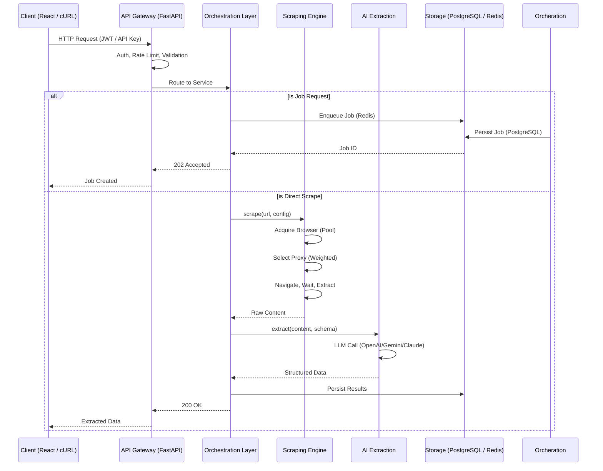

```


██████╗  █████╗ ████████╗ █████╗ ███████╗ ██████╗ ██████╗  ██████╗ ███████╗
██╔══██╗██╔══██╗╚══██╔══╝██╔══██╗██╔════╝██╔═══██╗██╔══██╗██╔════╝ ██╔════╝
██║  ██║███████║   ██║   ███████║█████╗  ██║   ██║██████╔╝██║  ███╗█████╗
██║  ██║██╔══██║   ██║   ██╔══██║██╔══╝  ██║   ██║██╔══██╗██║   ██║██╔══╝
██████╔╝██║  ██║   ██║   ██║  ██║██║     ╚██████╔╝██║  ██║╚██████╔╝██║
╚═════╝ ╚═╝  ╚═╝   ╚═╝   ╚═╝  ╚═╝╚═╝      ╚═════╝ ╚═╝  ╚═╝ ╚═════╝ ╚═╝

 █████╗ ██╗          ██╗██╗██╗
██╔══██╗██║          ██║██║██║
███████║██║          ██║██║██║
██╔══██║██║          ██║██║██║
██║  ██║███████╗     ██║██║██║
╚═╝  ╚═╝╚══════╝     ╚═╝╚═╝╚═╝

```

<p align="center">
  
  
  
  
  
  
  
  
</p>

<h1 align="center">Enterprise AI Web Intelligence & Data Extraction Platform</h1>

<p align="center">
  DataForge AI is a production-grade platform for browser-based web scraping, AI-powered structured data extraction, and scheduled intelligence gathering. It combines automated browser orchestration via Playwright, a multi-provider LLM extraction engine, and a Redis-backed priority job queue into a single deployable system with a React admin dashboard.
</p>

---

## Key Features

| Feature | Description |
|---------|-------------|
| **Browser Automation** | Playwright (Chromium) engine with a pre-warmed, auto-scaled browser pool, health checks, and anti-bot evasion |
| **AI Extraction** | Multi-provider LLM extraction (OpenAI, Gemini, Claude, DeepSeek) with schema-validated JSON output, classification, contact, and table extraction |
| **Proxy Management** | Weighted proxy pool with health scoring, automatic ban detection, country-based filtering, and periodic validation |
| **Queue System** | Redis-based priority queues (critical, high, default, low, retry, dead-letter) with exponential backoff and scheduled job support |
| **Scheduling** | APScheduler (asyncio) integration supporting cron expressions, interval-based, and one-time schedules with job persistence |
| **Monitoring** | Prometheus metrics (jobs, scrapes, extractions, queue depth, browser pool, proxy pool), Sentry error tracking, structured JSON logging |
| **Authentication** | JWT access/refresh token rotation, API key authentication with bcrypt password hashing, role-based access control |
| **REST API** | Versioned REST API (v1) with auto-generated OpenAPI docs, CORS configuration, and rate limiting |

---

## Architecture



---

## Technology Stack

| Layer | Technology |
|-------|-----------|
| Backend | Python 3.12, FastAPI 0.111, SQLAlchemy 2.0 (async), Pydantic v2 |
| Database | PostgreSQL 16, Redis 7 |
| Browser Automation | Playwright 1.44 (Chromium) |
| AI/LLM | OpenAI GPT-4o, Google Gemini, Anthropic Claude, DeepSeek |
| Queue | Redis-based priority queues (6 tiers) |
| Scheduler | APScheduler 3.10 (asyncio) |
| Monitoring | Prometheus, Sentry SDK, structured JSON logging |
| Frontend | React 18, TypeScript 5, Vite 5, Tailwind CSS 3 |
| Auth | JWT (access + refresh tokens), API keys, bcrypt, python-jose |
| Deployment | Docker, Docker Compose, Nginx |
| CI/CD | GitHub Actions |

---

## Quick Start

### Docker (recommended)

```bash
# Clone and start all services
cd infra
cp .env.example .env
docker compose up -d

# Verify health
curl http://localhost:8000/health

# View logs
docker compose logs -f api worker

# Scale workers horizontally
docker compose up -d --scale worker=4
```

### Local Development

Prerequisites: Python 3.12+, Node.js 20+, PostgreSQL 16, Redis 7

```bash
# Backend
cd backend
python -m venv venv
.\venv\Scripts\activate   # Windows
# source venv/bin/activate # Linux/macOS

pip install -r requirements.txt
playwright install chromium

# Configure environment
cp ..\infra\.env.example .env
# Edit .env: DATABASE_URL, REDIS_URL, LLM_API_KEY

# Start API server
uvicorn dataforge.backend.app.main:app --reload --port 8000

# Start worker (separate terminal)
.\venv\Scripts\activate
python backend/worker.py

# Frontend (separate terminal)
cd frontend
npm install
npm run dev

# Open http://localhost:5173
```

---

## API Overview

The REST API is versioned under `/api/v1` and includes modules for:

| Module | Prefix | Purpose |
|--------|--------|---------|
| Auth | `/auth` | Login, register, API keys, JWT refresh |
| Users | `/users` | User profile management |
| Projects | `/projects` | Organizational grouping of targets |
| Targets | `/targets` | Scraping target definitions |
| Jobs | `/jobs` | Job lifecycle (create, cancel, retry) |
| Proxies | `/proxies` | Proxy pool management |
| Schedules | `/schedules` | Cron and interval scheduling |
| Extractions | `/extractions` | AI extraction endpoints |
| Monitoring | `/monitoring` | Health, stats, queue status |

Interactive documentation is available at `/docs` (Swagger UI) when the server is running.

See [`docs/API.md`](docs/API.md) for complete endpoint reference.

---

## Project Structure

```
dataforge-ai/
├── backend/
│   ├── app/
│   │   ├── api/v1/              # REST API route handlers
│   │   ├── core/                # Config, database, security, DI, rate limiter
│   │   ├── extraction/          # AI extraction (LLM client, extractor, transformers)
│   │   ├── models/              # SQLAlchemy ORM models (13 tables)
│   │   ├── monitoring/          # Prometheus metrics, structured logging
│   │   ├── proxy/               # Proxy manager, checker, weighted rotator
│   │   ├── scraping/            # Playwright engine, browser pool, anti-bot, CAPTCHA
│   │   ├── scheduler/           # APScheduler integration
│   │   └── worker/              # Queue manager, task processor
│   ├── migrations/              # Alembic database migrations
│   ├── tests/                   # Unit and integration tests
│   ├── worker.py                # Standalone worker entrypoint
│   ├── Dockerfile               # API container
│   └── Dockerfile.worker        # Worker container
├── frontend/
│   ├── src/
│   │   ├── components/          # Reusable React components
│   │   ├── pages/               # Route views (Dashboard, Jobs, Targets, etc.)
│   │   ├── services/            # API client with JWT refresh
│   │   ├── types/               # TypeScript type definitions
│   │   └── styles/              # Tailwind CSS globals
│   ├── package.json
│   └── Dockerfile
├── infra/
│   ├── docker-compose.yml       # PostgreSQL, Redis, API, Worker, Nginx
│   ├── docker-compose.prod.yml  # Production overrides
│   ├── nginx/                   # Nginx reverse proxy config
│   └── .env.example             # Environment template
├── .github/workflows/           # CI/CD pipelines
├── pyproject.toml
└── README.md
```

---

## Database Schema

| Table | Description | Key Columns |
|-------|-------------|-------------|
| `users` | User accounts | email, password_hash, role, is_active |
| `api_keys` | API key authentication | key_hash, key_prefix, scopes, rate_limit_per_minute |
| `projects` | Organizational grouping | name, max_concurrent_jobs, monthly_request_limit |
| `project_members` | User-project membership | user_id, project_id, role (owner/admin/member) |
| `targets` | Scraping target config | url, javascript_enabled, extraction_strategy, output_schema |
| `jobs` | Scraping job instances | status, priority, retry_count, config, url |
| `runs` | Individual execution attempts | status, attempt_number, worker_id, navigation_ms |
| `pages` | Scraped page content | raw_html, cleaned_text, links, images, ai_classification |
| `scrape_results` | Completed scrape output | cleaned_text, screenshot_path, bot_score, captcha_detected |
| `extraction_results` | AI extraction output | extracted_data, confidence_score, llm_model, tokens_total, cost_usd |
| `proxies` | Proxy pool | host, port, protocol, weight, score, country, latency_ms |
| `schedules` | Recurring job schedules | interval, cron_expression, max_runs, runs_so_far |
| `logs` | Structured application logs | level, source, message, correlation_id |
| `usage_records` | Usage and billing data | action, ai_tokens_used, ai_cost_usd, credits_consumed |

All tables inherit UUID primary keys and `created_at` / `updated_at` timestamps from a shared `TimestampMixin` base.

---

## Key Design Decisions

1. **FastAPI over Django REST** — Async-native framework with native Pydantic v2 integration for request/response validation, automatic OpenAPI generation, and lightweight dependency injection. Suitable for high-concurrency I/O-bound workloads like browser orchestration and LLM API calls.

2. **Redis priority queues over Celery** — Celery introduces broker complexity, serialization overhead, and a heavy worker runtime. Redis list/zset operations provide sufficient semantics with simpler operational overhead. The queue manager implements 6 priority tiers, delayed execution via sorted sets, and dead-letter routing with exponential backoff.

3. **Direct LLM API calls over LangChain** — LangChain introduces abstraction overhead, frequent breaking changes, and vendor lock-in. Direct `httpx` calls to provider endpoints give full control over prompt construction, token accounting, response format handling, and cost tracking. The `LLMClient` supports OpenAI, Gemini, Claude, and DeepSeek without external orchestration dependencies.

4. **Playwright over Puppeteer/Selenium** — Playwright provides native async Python bindings, auto-wait APIs, networkidle detection, browser context isolation, and built-in emulation capabilities. Single-browser (Chromium) deployment reduces image size and attack surface while covering the majority of web scraping use cases.

5. **Browser pool with health checks** — Browser contexts are expensive to create (~2-3s per launch). The pool pre-warms to a configurable minimum size, reuses contexts up to a maximum use count (default 50), runs periodic health checks against `about:blank`, and automatically replenishes unhealthy instances. This prevents memory leaks and ensures predictable latency.

6. **Weighted proxy selection** — Proxies are scored on a composite metric of success rate, latency, consecutive failures, and total ban count. Selection uses a weighted random algorithm that biases toward higher-scoring proxies while still probing lower-scored ones. Failed requests decrement scores and eventual failure cascades to automatic deactivation.

---

## Security

Authentication uses JWT access tokens (configurable TTL, default 30 min) with refresh token rotation. API keys are hashed with SHA-256 — only the 8-character prefix is stored for identification. Passwords are hashed with bcrypt. Role-based access control enforces three tiers (admin, user, viewer) at the project membership level. CORS is configurable via environment variables. Rate limiting is applied per API key (configurable requests/minute). SQL injection is prevented through SQLAlchemy ORM parameterization.

---

## License

MIT — see [LICENSE](LICENSE) for details.

---

## Contributing

See [CONTRIBUTING.md](CONTRIBUTING.md) for guidelines on development workflow, coding standards, and pull request process.
