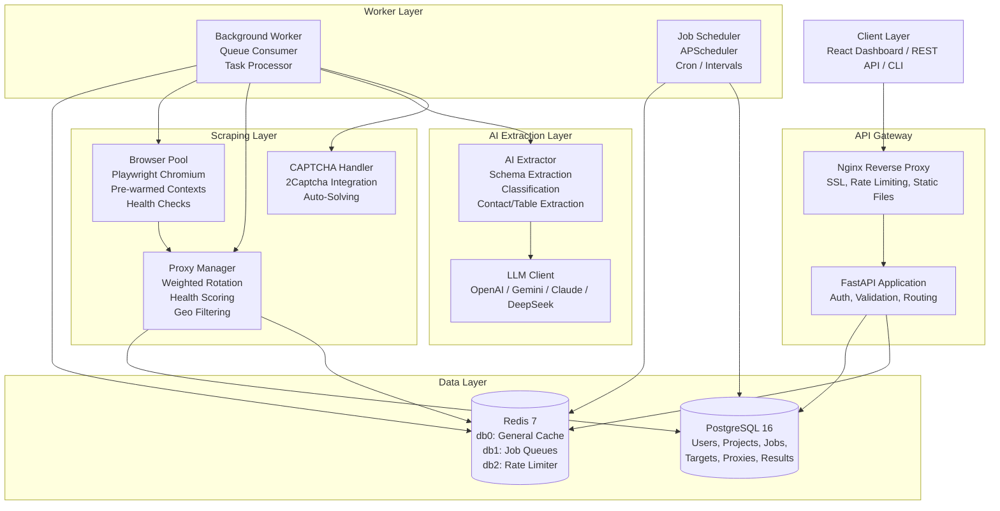

# Architecture

## System Overview

DataForge AI is a distributed web intelligence platform built on a microservices-inspired architecture. The system orchestrates browser automation, proxy rotation, AI-powered extraction, and job scheduling through an async Python backend with Redis-based queues and PostgreSQL persistence.

---

## System Context Diagram



---

## Backend Component Diagram

```
┌──────────────────────────────────────────────────────────────┐
│                        FastAPI App                            │
│  ┌──────────┐ ┌──────────┐ ┌──────────┐ ┌───────────────┐   │
│  │   Auth   │ │  Users   │ │ Projects │ │    Targets     │   │
│  │  Router  │ │  Router  │ │  Router  │ │    Router      │   │
│  └────┬─────┘ └────┬─────┘ └────┬─────┘ └───────┬───────┘   │
│  ┌────┴─────┐ ┌────┴─────┐ ┌────┴─────┐ ┌───────┴───────┐   │
│  │   Jobs   │ │ Proxies  │ │Schedules │ │ Extractions   │   │
│  │  Router  │ │  Router  │ │  Router  │ │   Router      │   │
│  └────┬─────┘ └────┬─────┘ └────┬─────┘ └───────┬───────┘   │
│  ┌────┴─────┐                                          │    │
│  │Monitoring│                                          │    │
│  │  Router  │                                          │    │
│  └──────────┘                                          │    │
└────────────────────────┬─────────────────────────────┬──┘    │
                         │                             │
                    ┌────▼────┐                  ┌─────▼──────┐
                    │  Core   │                  │   Core     │
                    │ Security│                  │Exceptions  │
                    └─────────┘                  └────────────┘
```

---

## Technology Decisions

| Decision | Choice | Rationale |
|----------|--------|-----------|
| **Web Framework** | FastAPI | Async-native, automatic OpenAPI docs, Pydantic v2 integration, high throughput |
| **ORM** | SQLAlchemy 2.0 async | Mature, well-tested, repository pattern compatible, migration support via Alembic |
| **Queue** | Redis RQ-style (custom) | Fewer moving parts than Celery, built-in priority queues, dead-letter support, no broker dependency beyond Redis |
| **Browser Automation** | Playwright | Multi-browser support, reliable selectors, native async API, network interception |
| **LLM Integration** | Direct API calls (no LangChain) | Full prompt control, token accounting, cost estimation, no dependency churn |
| **Scheduling** | APScheduler (async) | Cron and interval triggers, lightweight, in-process (no separate scheduler service) |
| **Containerization** | Docker + Compose | Single-host orchestration with service scaling, health checks, volume management |

## Key Trade-offs

**Browser Pool over Per-Request Launch:** Pre-warming browser contexts adds ~30s to startup but eliminates 3-5s cold-start latency per scrape. The pool automatically scales between `browser_pool_min` and `browser_pool_max` instances and replaces unhealthy contexts after `browser_pool_max_uses_per_context` uses.

**Weighted Proxy Selection over Round-Robin:** Proxies are scored by success rate, latency, and consecutive failures. High-scoring proxies are selected more frequently, while failing proxies degrade gracefully. This increases overall success rate at the cost of uneven per-proxy utilization.

**Single Redis Instance over Cluster:** The platform uses Redis for three concerns (cache, queue, rate limiter) on separate logical databases. A single instance suffices for moderate throughput; a Redis Cluster or separate instances can be introduced when Redis becomes a bottleneck.

**In-Process Scheduler over External Cron:** APScheduler runs inside the API process. This simplifies deployment (no separate scheduler container) but means scheduling pauses during rolling restarts. For high-availability environments, the scheduler can be run in a dedicated container.

---

## Directory Structure

```
dataforge-ai/
├── backend/
│   ├── app/
│   │   ├── api/v1/          ─ REST endpoint handlers, grouped by resource
│   │   │   ├── auth.py       Authentication (login, register, API keys)
│   │   │   ├── users.py      User profile management
│   │   │   ├── projects.py   Project CRUD with membership
│   │   │   ├── targets.py    Scraping target definitions
│   │   │   ├── jobs.py       Job lifecycle (create, cancel, retry, results)
│   │   │   ├── proxies.py    Proxy pool management
│   │   │   ├── schedules.py  Recurring job schedules
│   │   │   ├── extractions.py AI extraction endpoints
│   │   │   └── monitoring.py Health, metrics, stats
│   │   ├── core/            ─ Shared infrastructure (config, database, security, DI)
│   │   ├── models/          ─ SQLAlchemy ORM models (users, projects, jobs, etc.)
│   │   ├── extraction/      ─ AI extraction logic (LLM client, extractors)
│   │   ├── monitoring/      ─ Prometheus metrics collectors, structured logging
│   │   ├── proxy/           ─ Proxy manager, health checker, weighted rotator
│   │   ├── scraping/        ─ Playwright engine, browser pool, anti-bot, CAPTCHA handler
│   │   ├── scheduler/       ─ APScheduler integration (cron/interval triggers)
│   │   ├── worker/          ─ Background task processor, queue manager
│   │   └── main.py          ─ FastAPI app factory (lifespan, middleware, routes)
│   ├── migrations/          ─ Alembic database migration scripts
│   └── tests/               ─ pytest test suite
├── frontend/                ─ React + Vite admin dashboard (separate deployment)
├── infra/                   ─ Docker Compose, Nginx config, environment templates
└── scripts/                 ─ Utility scripts (dev setup, data seeding, maintenance)
```

The backend follows a layered architecture:

- **Interface Layer** (`api/v1/`): HTTP handlers that validate input and serialize responses. No business logic.
- **Service Layer** (`extraction/`, `proxy/`, `scraping/`): Business logic classes with clear interfaces. Dependencies are injected via constructors.
- **Persistence Layer** (`models/`, `core/database.py`): SQLAlchemy ORM with async sessions. Repository queries are embedded in service classes.
- **Infrastructure Layer** (`core/`, `monitoring/`): Configuration, security primitives, database sessions, metrics, logging.
